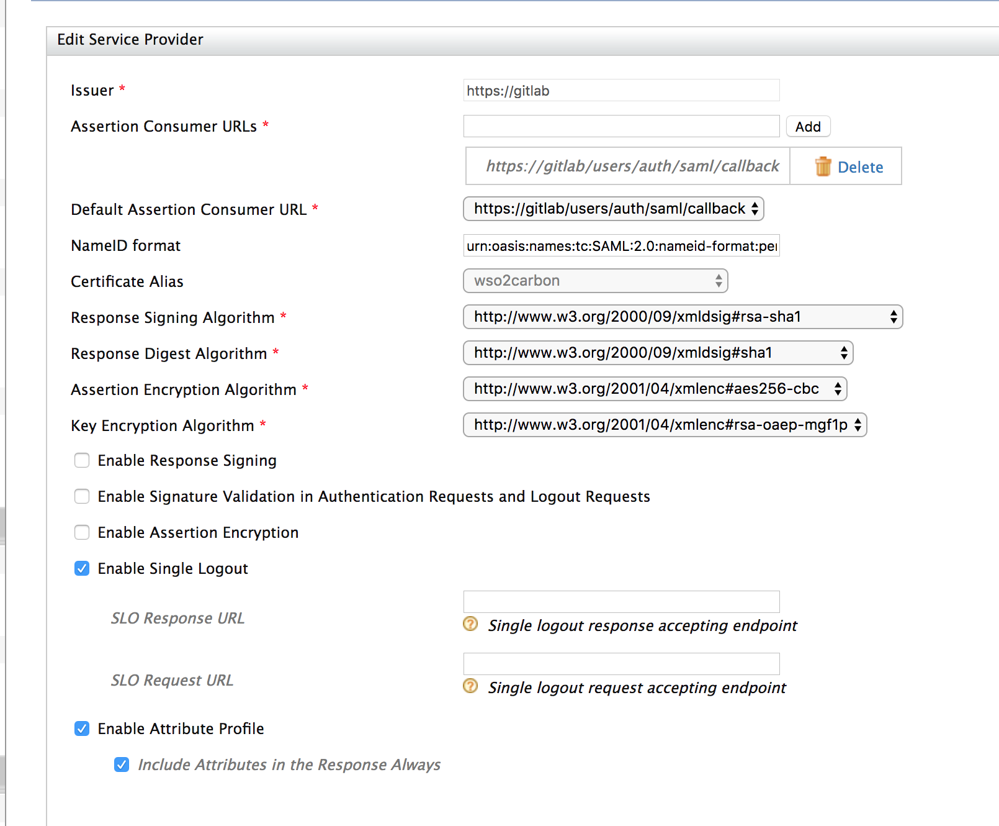
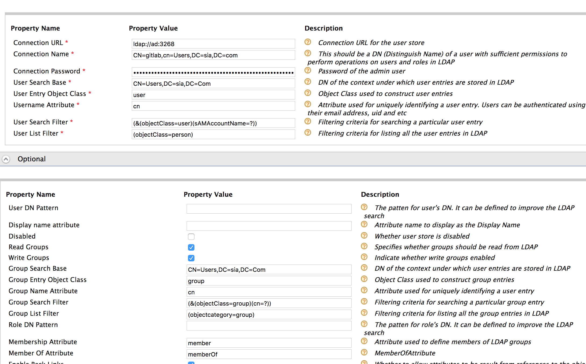

# gitlab-wso2

Integrate gitlab with WSO2 IS and saml service provider

https://docs.gitlab.com/ee/integration/saml.html

Service provider configuration is attached below

Claim configuration

Windows AD user store configuration

